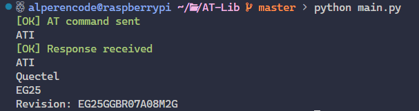
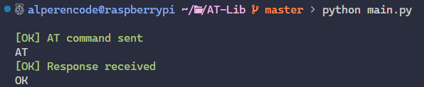

# AT-Lib (In-Development)

Python library/module for sending [AT Commands](https://en.wikipedia.org/wiki/Hayes_AT_command_set) to modems and handling responses.

## Table of Contents
- [AT-Lib (In-Development)](#at-lib-in-development)
  - [Table of Contents](#table-of-contents)
  - [Usage](#usage)
  - [End-User Usage](#end-user-usage)
  - [Developer Usage](#developer-usage)
    - [Creating instance:](#creating-instance)
    - [Sending at command:](#sending-at-command)
    - [Receiving response](#receiving-response)
    - [Send and Get](#send-and-get)
  - [Proper Output](#proper-output)
  - [License](#license)

## Usage

## End-User Usage

Enter at commands as an input and program will automatically send all the commands and receive responses

**Input:**

```bash
$ python main.py AT ATI
```

**Output:**


**Input:**

```bash
$ python main.py AT '' AT?
```

**Output:**


<br><hr>

## Developer Usage


### Creating instance:

```python
from source.atlib import ATLIB
at = ATLIB(ATLIB.get_port())
```

<hr>

### Sending at command:

**Input:**
```python
at.send_at("ATI")
```

**Output:**


<hr>

### Receiving response

**Input:**
```python
at.send_at("ATI")
print(at.get_response())
``` 

**Output:**



**Input:**
```python
at.send_at("AT+CMD")
print(at.get_response())
```
 
**Output:**


**Input:**
```python
at.send_at("")
print(at.get_response())
```

**Output:**


<hr>

### Send and Get

**Input:**
```python
print(at.send_and_get("AT"))
```
 
**Output:**



## Proper Output

**With given input:**

```python
from source.atlib import ATLIB


if __name__ == "__main__":
    at = ATLIB(ATLIB.get_port())

    commands = [
        "AT",
        "ATI",
        "AT*NOKIATEST",
        "AT+CMD",
        "",
        "AT+CSQ",
    ]

    for command in commands:
        print(at.send_and_get(command))
```

**Output:**


## License

This project is licensed under the [MIT License](LICENSE).
